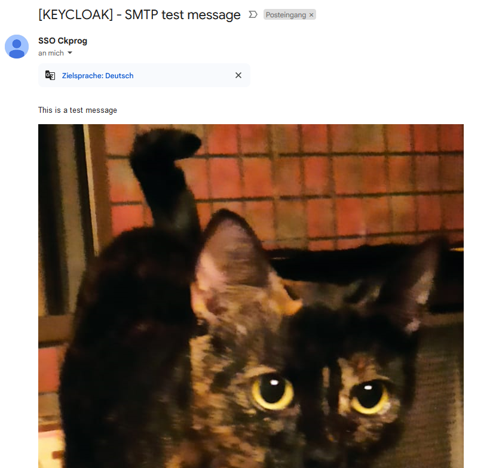
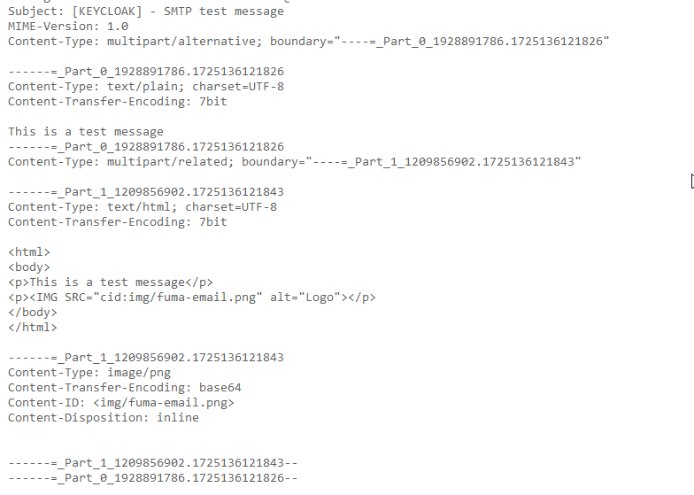

# Credits

A lot of work of this project is from other people.

I've just put it together and provide example templates for how to use with keycloakify

Thanks to [@sventorben](https://github.com/sventorben) for writing a keycloak email spi tutorial

Thanks to [@bocca](https://github.com/bocca) for supplying the already implemented cid code

Thanks to [@keycloak](https://github.com/keycloak) for providing this program as open source

SPI List:

https://github.com/keycloak/keycloak/blob/2ab9d04136a6d8112c499ab80a8ffbcfba618507/server-spi-private/src/main/resources/META-INF/services/org.keycloak.provider.Spi#L55

Source Code:

https://github.com/keycloak/keycloak/issues/26347#issue-2091407640

Tutorial:

https://conciso.de/keycloak-spis-implementieren-schritt-fuer-schritt/

Keycloak Docs:

https://www.keycloak.org/docs/25.0.4/server_development/index.html#_override_builtin_providers

Keycloak Sources:

https://github.com/keycloak/keycloak/blob/25.0.4/services/src/main/java/org/keycloak/email/DefaultEmailSenderProvider.java

# Build instructions

Build the project with ```mvn package```

Move the created ```email-provider-mime-0.1.jar``` to the providers directory within the keycloak directory

Update the providers by either using start-dev or build

# Debugging

You can add ```--log-level="INFO,org.keycloak.email.DefaultEmailSenderProvider:debug"``` as a start parameter to enable the debug logs of this module

# Example

You can view a fully working keycloakify example here

https://github.com/ckbaker10/keycloakify-starter/tree/email2fa-styling

The commit of interest is here: https://github.com/ckbaker10/keycloakify-starter/commit/5e94503e0084d3c026da70a311902f9f987d69a0

Using this provider allows for images to be displayed properly in email clients



Proof of the image beeing sent as mime part



